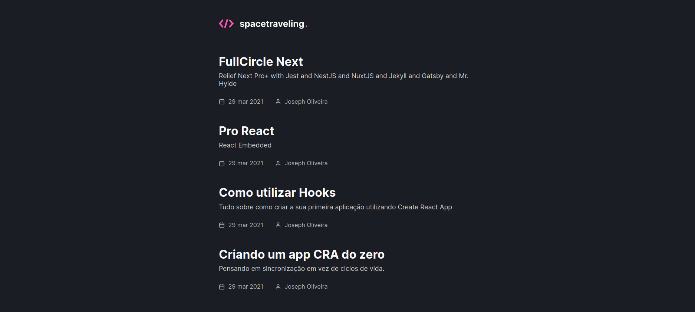
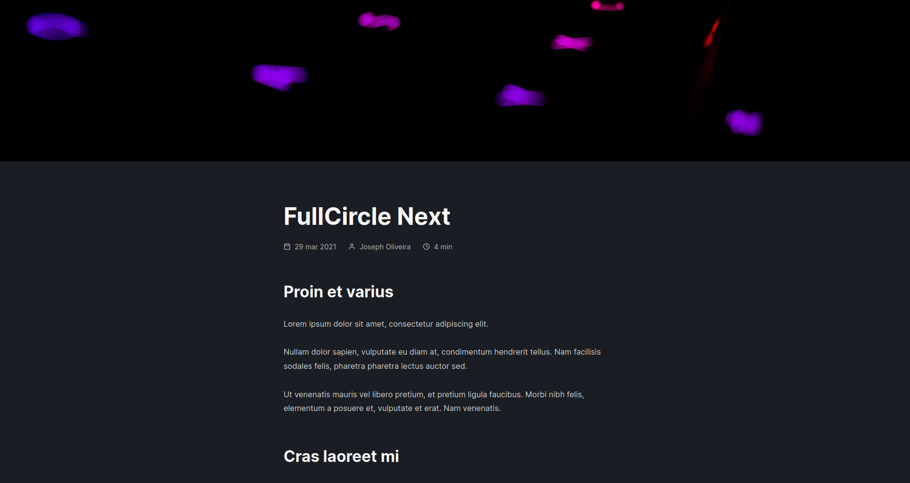

# Rocket Seat Ignite - Pretentious Tech Blog

<p align="center">
  
</p>

<p align="center">
  
</p>

[](https://app.netlify.com/sites/blissful-brahmagupta-a9be45/deploys)

- Production: https://tech1776.netlify.app/

## Table of Contents

- [About](#about)
- [Getting Started](#getting_started)
- [Usage](#usage)
- [Docs](#docs)
- [Resources](#resources)

## About <a name = "about"></a>

A tech blog made with ReactJS, NextJS and Prismic.

- [Figma](https://www.figma.com/file/0Y26j0tf1K2WB5c1ja5hov/Desafios-M%C3%B3dulo-3-ReactJS?node-id=0:1)

## Getting Started <a name = "getting_started"></a>

### Prerequisites

- `node >= 12.0.0`

### Installation

1. Clone this repo locally and install the required packages:

```bash
$ git clone https://github.com/librity/ignite_blog.git
$ cd ignite_blog
$ yarn install
```

2. Start a dev server:

```bash
$ yarn dev
```

3. Open http://localhost:3000 on your web browser.

## Usage <a name = "usage"></a>

On the home screen, you can edit, delete and disable items.
You can create a new item by clicking in `Novo Prato`.

## Docs <a name = "docs"></a>

- https://prismic.io/docs/technologies/javascript
- https://prismic.io/docs/technologies/getting-started-nextjs
- https://intercom.help/prismicio/en/
- https://developer.mozilla.org/en-US/docs/Web/API/Fetch_API/Using_Fetch
- https://react-icons.github.io/react-icons/
- https://date-fns.org/docs/Getting-Started
- https://nextjs.org/docs/basic-features/data-fetching#fallback-pages

## Resources <a name = "resources"></a>

- https://www.tutorialspoint.com/typescript/typescript_interfaces.htm
- https://unsplash.com/s/photos/code
- https://www.uuidgenerator.net/
- https://anadea.info/tools/online-business-name-generator/tech-company/search
